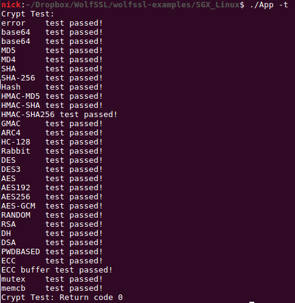
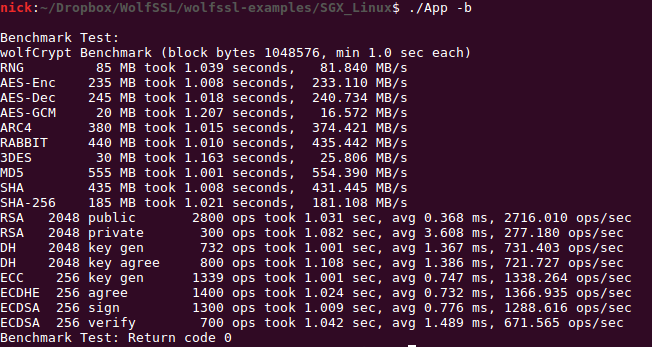

# wolfSSL Linux Enclave Example

This repository contains an example application, written in C, which demonstrates how to link with the wolfSSL lightweight SSL/TLS library with a simple Enclave using Linux. The example has been tested with Ubuntu 16.04.

Note that the example passes pointers using [user_check]. For more information
about what [user_check] is, and precautions needed when developing an application
that uses it, see Intel documentation located here
https://software.intel.com/en-us/sgx-sdk-dev-reference-attribute-user-check. An
application could be developed to completely avoid passing the WOLFSSL_CTX
pointer between trusted and untrusted code for more security.

## Prerequisites

First create the trusted static wolfssl library from `<wolfssl-root>/IDE/LINUX-SGX`. Steps for creating the static library can be found in `<wolfssl-root>/IDE/LINUX-SGX/README.md`

## Build

After creating the static library, build the example untrusted application using make. For make the user should specify:
1. Specify SGX Mode. This can be either SIM or HW

	`SGX_MODE=[SIM,HW]`

2. Whether SGX should be built as Prerelease or regular release

    `SGX_PRERELEASE=[1,0]`

3. Specify if SGX Debug should be set. (This also controls whether wolfssl debug prints, if it was enabled at compile-time for the static library).

    `SGX_DEBUG=[1,0]`

4. The location of the prebuilt static library (this will probably point to `<wolfssl-root>/IDE/LINUX-SGX`)

    `SGX_WOLFSSL_LIB=[location/to/libwolfssl.sgx.static.a]`

5. The location of wolfssl root directory for the header files.

    `WOLFSSL_ROOT=[location/to/wolfssl_root]`

6. Whether benchmark tests have been enabled. *NOTE: These must be enabled during compilation of the static library as well. See the README in `<wolfssl-root>/IDE/LINUX-SGX/README.md`*

    `HAVE_WOLFSSL_BENCHMARK=[0/1]`

6. Whether wolfcrypt tests have been enabled. *NOTE: These must be enabled during compilation of the static library as well. See the README in `<wolfssl-root>/IDE/LINUX-SGX/README.md`*

    `HAVE_WOLFSSL_TEST=[0/1]`


With these three options, simply call, for example:

```make SGX_MODE=SIM SGX_PRERELEASE=0 SGX_WOLFSSL_LIB=~/wolfssl/IDE/LINUX-SGX/ WOLFSSL_ROOT=../../wolfssl SGX_DEBUG=0 HAVE_WOLFSSL_TEST=1```

### Expected Output


## Running
After building, the user can specify one of a set of options to be run via the command line. These are:

* -c: Run a TLS Client in an enclave
  * This option runs an example TLS client in enclave to connect to a server on port 11111.
* -s: Run a TLS Server in an enclave
  * This option runs an example TLS server in enclave to receive clients on port 11111.
* -t: Run wolfCrypt tests in an enclave
  * This option runs the wolfCrypt tests. *NOTE: These must be enabled during compilation of the static library as well. See the README in `<wolfssl-root>/IDE/LINUX-SGX/README.md`*
* -b: Run wolfCrypt benchmarks in an enclave
  * This option runs the wolfCrypt benchmarks in an enclave. These benchmarks will be somewhat faster than standard benchmarks because the benchmarks are operating entirely within the enclave and buffers don't need to be moved across the enclave boundary between calls. *NOTE: These must be enabled during compilation of the static library as well. See the README in `<wolfssl-root>/IDE/LINUX-SGX/README.md`*

To test the enclave client against the enclave server:

### First, start the enclave server.
    ./App -s

### Then, start the enclave client
    ./App -c

This will connect an enclave client, in one enclave, to an enclave server, in a second enclave. These can also be replaced by the wolfssl example client/server. For example, to test a standard client against an enclave server, start the enclave server and then run <wolfssl-root>/examples/client/client.

### Expected Output






## Limitations

1) Single Threaded

2) No Filesystem

3) Untrusted Code Must Load Private Key/Certificate Chain

    i) In order to successfully load a private key and certificate into the enclave, these APIs are exposed to the untrusted application. This means that the untrusted region must be "trusted" to load the correct Private Key/ Certificate to start a connection. This method of loading certificates should not be used for production code as it violates the trust assumptions for Intel's SGX. Contact <support@wolfssl.com> if you wish to use wolfSSL in your product.

## Support

Please contact wolfSSL at support@wolfssl.com with any questions, bug fixes, or suggested feature additions.

